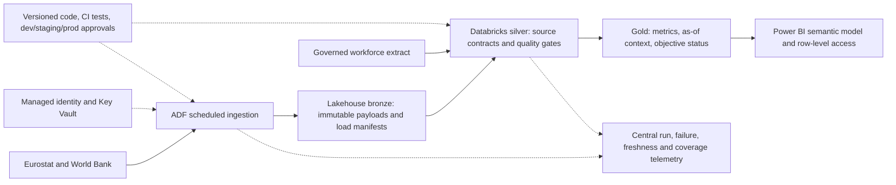

# Architecture

```text
Authoritative public sources / replay fixtures
                  |
                  v
       source adapters + source metadata
                  |
                  v
       canonical external-signal records
                  |
                  +---- supplied lifecycle fixture ----+
                  |                                     |
                  v                                     v
            quality validation  ---> quality report  retention metrics
                  |                                     |
                  +------------- temporal integration --+
                                                    |
                                                    v
                                      API / local dashboard / evidence exports
```

The local solution maps to an ADF-style scheduled orchestration layer, lakehouse bronze/silver/gold storage, and Power BI consumption in production. Secrets belong in a managed key vault; source, job, and quality telemetry feed central observability; role-based access limits raw employee data; environment-specific configuration and CI validation control promotion from development through production.


## Boundaries and operations

`ingest_external` owns network retrieval and atomic replacement of each independently validated public snapshot. `sources` owns decoding and canonical metadata. `quality` owns employee eligibility. `metrics` owns business definitions. `integration` owns estimated as-of matching and country association summaries. `analysis` runs the SQLite consumption query. `run` orchestrates those modules before writing deterministic CSV/JSON evidence. The browser reads only aggregate metrics, signal context and quality counts; it does not request the employee export.

The original fixtures are immutable during the core workflow. A refresh intentionally changes raw public snapshots and requires rerunning the core workflow. No credentials are needed. Failed refreshes return a nonzero status and per-source diagnostics. Replay parse errors stop calculation before evidence outputs are written. Local outputs overwrite the same named files on successful reruns. Full multi-file transactional publication, retries with backoff, and incremental ingestion remain production work.

The local HTTP server is for synthetic review data only. Run it on loopback. Serving the repository makes its files accessible locally, including the synthetic employee export; production hosting must expose only a dedicated aggregate output directory.

## Production mapping



Schedule refreshes according to monthly/quarterly/annual source cadence and workforce extraction cadence. Retain source versions and publication timestamps in bronze, partition canonical records by indicator/country/period, and publish gold only after reconciliation. Restrict employee-level silver data to approved roles; expose only aggregates to Power BI. Separate environments, storage paths and managed identities. Promote a tested code version and schema together, retaining a rollback snapshot. Alert on missing coverage, stale loads, excessive exclusions and failed reconciliation. Real historical analysis needs vintages, not just current snapshots.

The current nested as-of matching is sufficient for 2,348 metric rows and 450 signals. At production scale, replace repeated filtering with partitioned sorted as-of joins and incremental recalculation of affected cohorts, then benchmark against representative volume. Deployment, authentication and secret management are explicit extensions.
